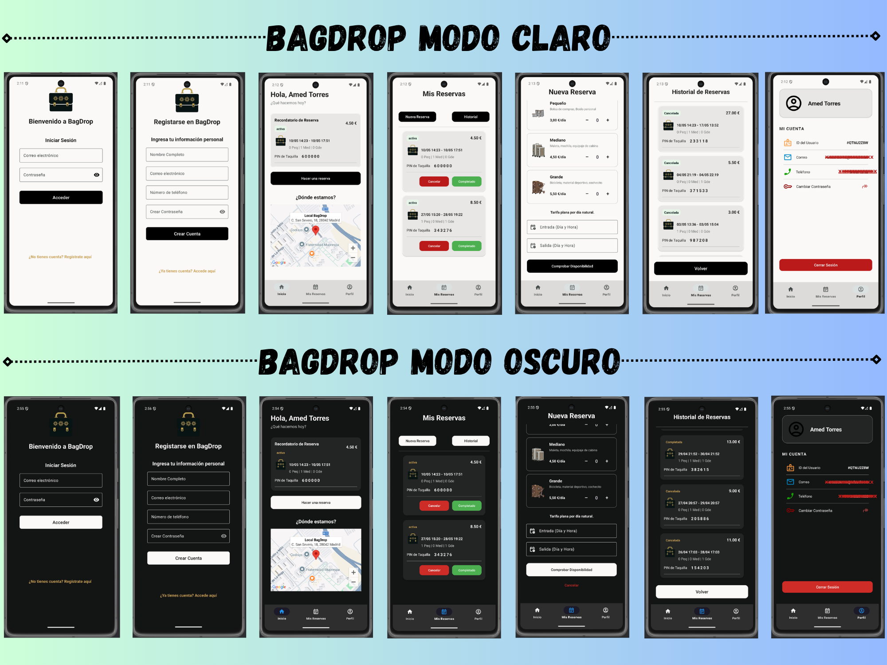

# 🧳 BagDrop | TFC - TFG DAM


**BagDrop** es una aplicación móvil nativa para Android diseñada para revolucionar la gestión de consignas de equipaje. Permite a los turistas localizar el local, comprobar la disponibilidad de taquillas en tiempo real y gestionar sus reservas de forma autónoma.

Este proyecto ha sido desarrollado como **Trabajo de Fin de Ciclo (TFC)** para el Grado Superior en Desarrollo de Aplicaciones Multiplataforma (DAM).

---

##  Vistazo a la Aplicación (Wireframes y Diseño)



---

##  Características Principales

- **Arquitectura Serverless:** Gestión total de usuarios y base de datos NoSQL documental delegada en la nube con Firebase.
- **Geolocalización Asíncrona:** Integración nativa con Google Maps SDK para la ubicación del local comercial.
- **Motor de Disponibilidad en Tiempo Real:** Algoritmo matemático de intervalos de fechas para calcular solapamientos de reservas y aforos máximos físicos del local.
- **Notificaciones Push Locales:** Uso avanzado de `AlarmManager` y `BroadcastReceiver` para despertar la aplicación y avisar al usuario 30 minutos antes de su reserva, incluso si la app está cerrada.
- **UI/UX Moderna:** Diseño fluido utilizando Material Design 3, `ViewBinding` para evitar fugas de memoria y soporte completo para Modo Oscuro.

---

##  Stack Tecnológico

* **Lenguaje:** Kotlin
* **Arquitectura:** Patrón Repositorio (Repository Pattern)
* **Asincronía:** Kotlin Coroutines (`suspend`, `await`, `lifecycleScope`)
* **Backend as a Service (BaaS):** * Firebase Authentication (Gestión de sesiones)
    * Firebase Cloud Firestore (Base de datos en tiempo real)
* **Servicios Externos:** Google Maps API

---

##  Instalación y Despliegue Local

Si deseas compilar o auditar el código fuente en tu propio entorno de desarrollo, sigue estos pasos:

1. **Clonar el repositorio:**
   ```bash
   git clone https://github.com/amedtorres/tfg_tfc_DAM.git

2. **Abrir en Android Studio (Versión Iguana o superior recomendada)**

3. **Configuración de Firebase:** Debes conectar tu propio proyecto de Firebase y añadir el archivo google-services.json en el directorio app/ del proyecto.

4. **Configuración de Google Maps:**
Por motivos de seguridad, la API Key ha sido retirada. Debes añadir tu propia clave en AndroidManifest.xml:
```bash
XML
<meta-data
    android:name="com.google.android.geo.API_KEY"
    android:value="TU_API_KEY_AQUI" /> 
```
5. **Sincronizar Gradle y compilar (Run).**

---

## Autor
Amed Torres | Desarrollador de Aplicaciones Multiplataforma (DAM) 💻

---

# Licencia
Este proyecto se distribuye bajo la **Licencia MIT**.
